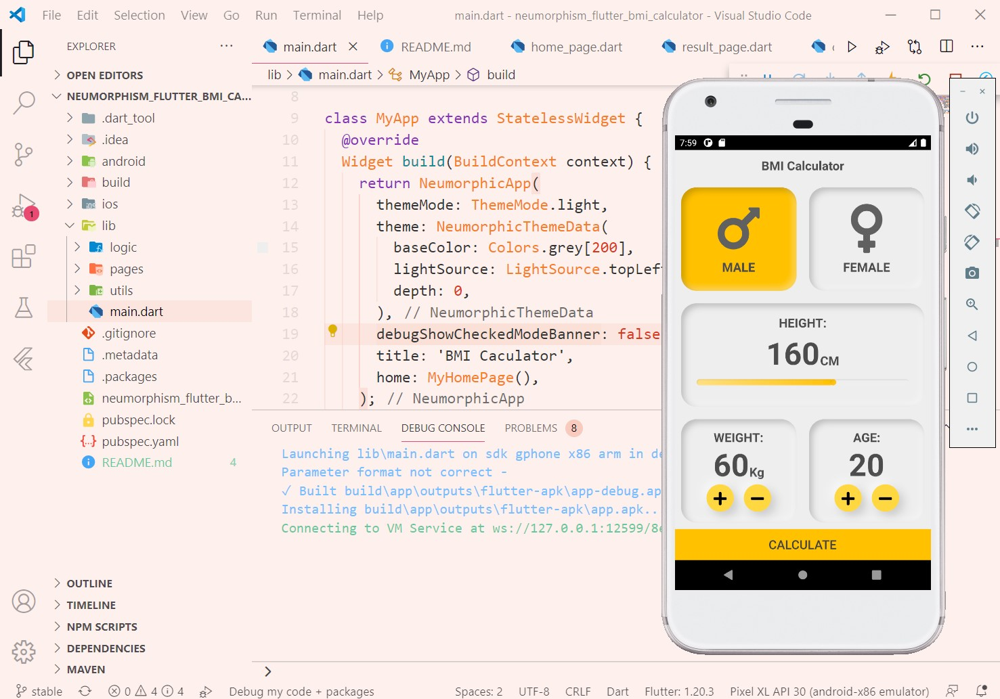

# neumorphism_flutter_bmi_calculator



A simple BMI Calculator app based on gender with neumorphic style! (actually gender and age are useless properties =)))

## Whit did I learn on this project?

- Theme: theme on flutter can be used on simply create a theme and use it throw whole project! In neumorphism design also we hava `NeumorphicTheme` that can be used like this:

```
NeumorphicTheme(
    themeMode: ThemeMode.light, //or dark / system
    darkTheme: NeumorphicThemeData(
        baseColor: Color(0xff333333),
        accentColor: Colors.green,
        lightSource: LightSource.topLeft,
        depth: 4,
        intensity: 0.3,
    ),
    theme: NeumorphicThemeData(
        baseColor: Color(0xffDDDDDD),
        accentColor: Colors.cyan,
        lightSource: LightSource.topLeft,
        depth: 6,
        intensity: 0.5,
    ),
    child: ...
)
```

- Dividing widgets into diffrent .dart files and costumize Flutter native widgets.

- ``final`` vs ``const`` key word! what is diffrence?!
this [link](https://stackoverflow.com/questions/50431055/what-is-the-difference-between-the-const-and-final-keywords-in-dart) have useful tips!

- Enusm! 

- Maps in dart

- Navigation on pages